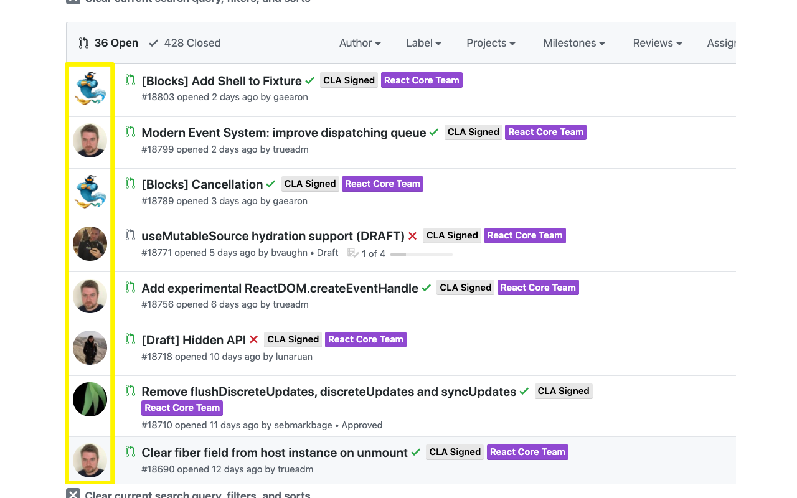
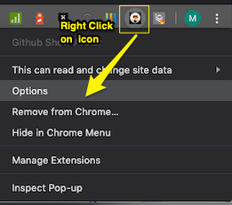

# Github Show Avatars

> Beware: You are going to see your colleagues' faces... even more."

This Chrome extension will display large avatar pictures in your pull requests and issues list in `Github.com`.  
Ideal to quickly identify who created a pull request in a second.  

## Getting Started

### Chrome extension

- Install [the extension](https://chromewebstore.google.com/detail/github-show-avatar/ndophfllmdjffpbglbeembkdimmeihfi) from the Chrome Web Store.  

- Go to a Github repo, in the Pull Requests.  
For instance, [here](https://github.com/facebook/react/pulls).  
You should now see the avatars of the developers that created those PRs.

#### Avatar Customization
To customize Avatars, right click on the extension's icon in Chrome's toolbar, and select "Options" in the context menu that appears.  

   

---

## Userscript

**Userscripts** work exactly like browser extensions - but they give developers more freedom to tweak and play with the source code.  
They don't have custom icons, nor have access to some native browsers methods, but are development is easier.

Functionally, the `Github Show Avatars` Chrome extension and userscript are doing the same.

### Prerequisite

The application is has been tested/styled on the latest version of Chrome and **Firefox**.

In order for your browser to run userscripts, you need to install a userscript manager extension. I recommend **Tampermonkey**.

1. Install the [Tampermonkey extension](https://chrome.google.com/webstore/detail/tampermonkey/dhdgffkkebhmkfjojejmpbldmpobfkfo)

2. Install the `Github Show Avatars` userscript in tampermonkey.

   Go to this [url](https://github.com/matthizou/github-show-avatars/raw/master/userscript/main.user.js)

   Tampermonkey will pick up the fact that you are displaying a raw userscript and will ask you if you want to install the script.

   Click the **install** button.

     

 3. Go to a Github repo, in the Pull Requests.  
 For instance, [here](https://github.com/facebook/react/pulls).  
You should now see the avatars of the developers that created those PRs.

## Author

-   **Matt Izoulet**
