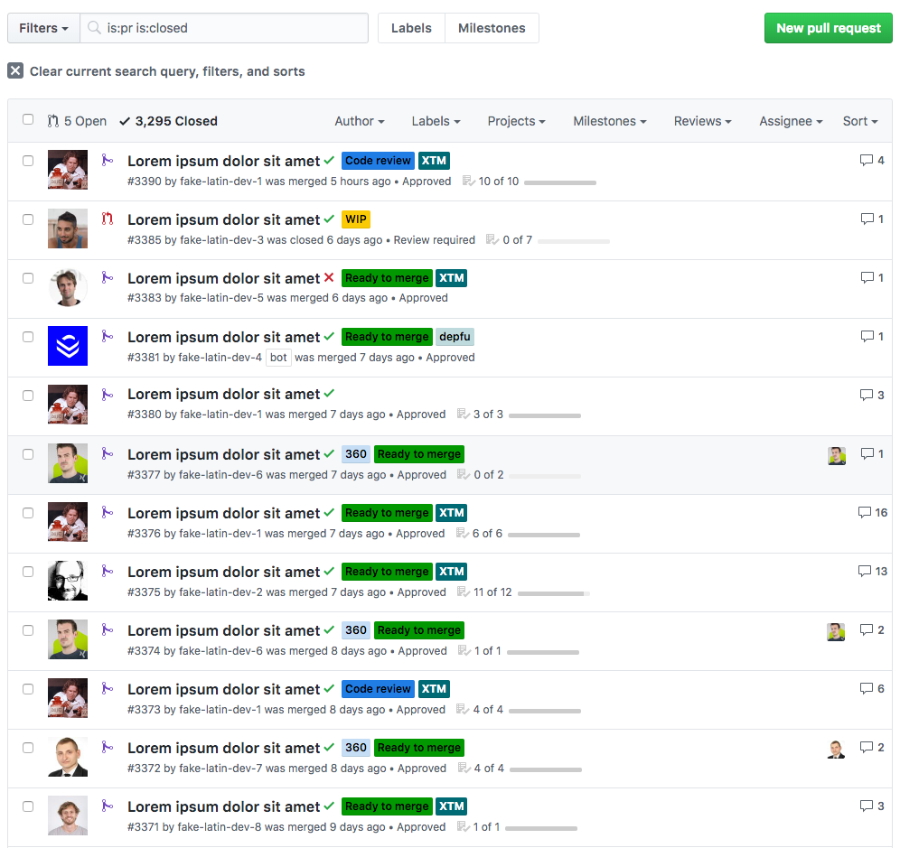
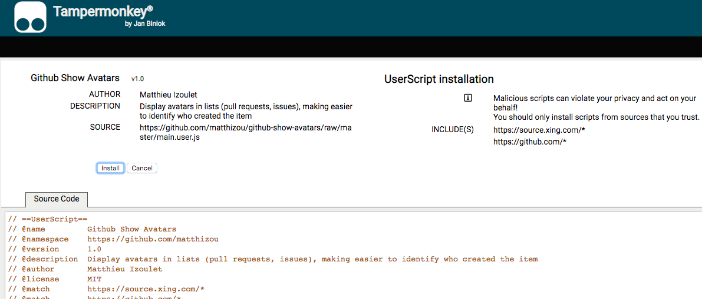
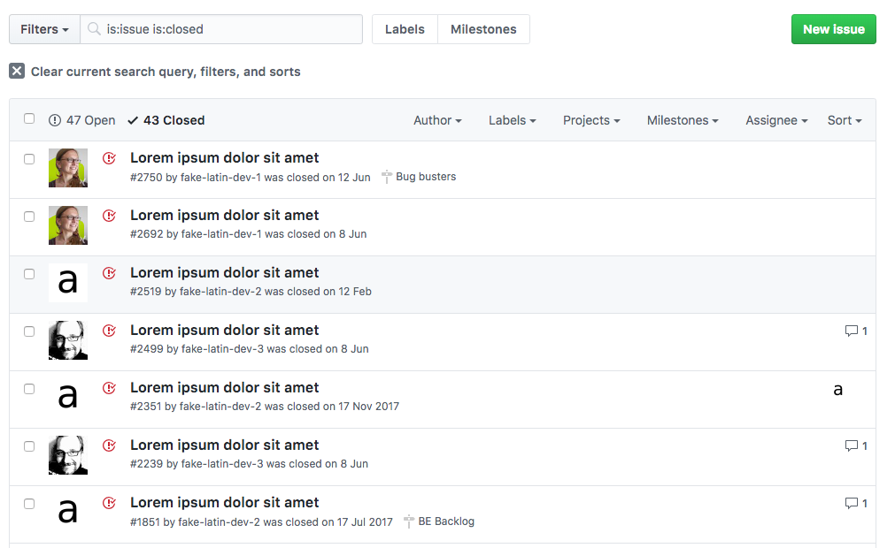
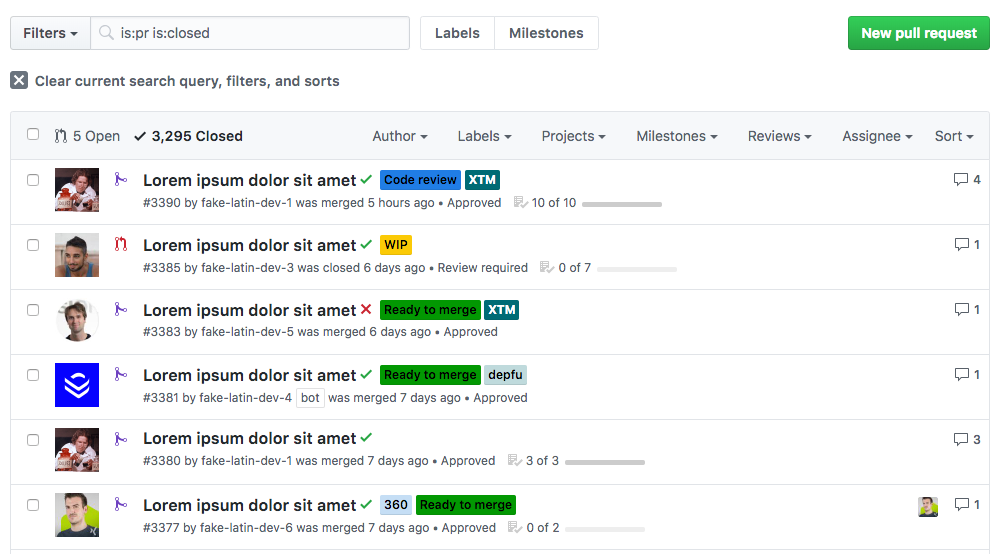

# Github Show Avatars

> Beware: You are going to see your colleagues' faces... even more."

Github is **awesome**... and yet sometimes you wish for a cooler UX, especially compared to its little brother Bitbucket.  
Maybe you are used to look at the long lists of pull requests of your team, several times a day, and sometimes you are struggling to spot who created what - the small author text doesn't really stand out !

Well, good news, You shall no longer put up with this.

This userscript will display a **large avatar picture** in each row, in lists such as pull requests and issues.

> The hell with compact display, I have a 27'' monitor after all !"

Doesn't it look better like this ?!

## Getting Started

### What is a userscript ?

**Userscripts** are little scripts injected in web pages to improve them. See them as addons, or extensions, (usually) scoped to pages or sites.  
Adding features/information, changing UI, hidding undesired ads, are typical examples of what they usually do.

### Prerequisite

The application is has been tested/styled on the latest version of Chrome. (It should also work with Firefox)

In order for your browser to run userscripts, you need to install a userscript manager extension. I recommand **Tampermonkey**  
Install the [Tampermonkey extension](https://tampermonkey.net/?ext=dhdg&browser=chrome)

### Installation

Go to this url: [/matthizou/github-show-avatars/raw/master/main.user.js](https://github.com/matthizou/github-show-avatars/raw/master/main.user.js)  
Tampermonkey will pick up the fact that you are displaying a raw userscript and will ask you if you want to install the script.  
Click the **install** button.

### Notes

The implementation has been kept simple and efficient, using a basic logic of scanning and storing the avatar urls in pull request pages. No extra server call is performed.

Consequently, **the first time** this script is activated, all users will get the default unknown avatar; but after entering a few pull requests, the script will accumulate data and display the correct avatars.

## Authors

- **Matthieu Izoulet**

## Acknowledgments

Thanks to [Xing](https://www.xing.com/) for encouraging the development of this script. Hack weeks are awesome !

## Full-size screenshots

Issues list  

Pull requests list  

