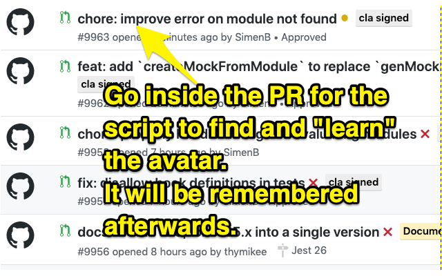
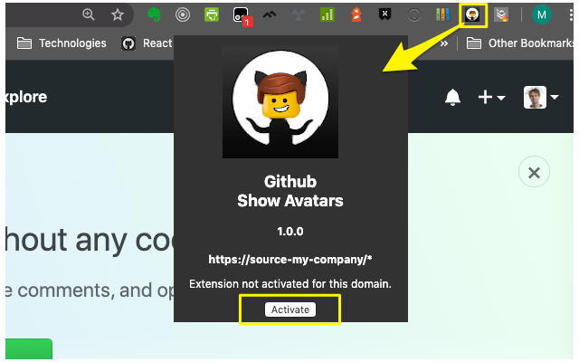

# Github Show Avatars

> Beware: You are going to see your colleagues' faces... even more."

This extension will display large avatar pictures in your pull requests and issues list in Github and Github Enterprise. Ideal to quickly identify who created a pull request in a second.
This extension goes further and enables you to overwrite certain avatars by your own, which can bring both fun and better readability in the pages where it is applied.
It can also display 2 avatars side-to-side, which is really helpful to signal the team that 2 people are taking care of an issue, or have paired together in the code of a pull request.

It supports Github Enterprise on any URL though a really simple process (simply click on the icon and then on "Activate" button)

Try it, you won't be disappointed.

## Getting Started

### Chrome extension

1. Download the extension from the Chrome Web Store

2. Initially,the extension doesn't know the users' avatars. You'll need to do a quick session of "machine learning" in order to have the default Github avatars replaced by the proper ones.  
   

3. To apply the extension on your Github Enterprise, simply click the extension icon when you ar in your domain, and click the Activate button.  
   

4. To customize Avatars, right click on the icon, and select "Options". You will be brought to this popup  
   

## Acknowledgments

Thanks to [New Work](https://www.new-work.se/en/) for encouraging creativity and encouraging the development of this script. Hackweeks are awesome!

## Author

-   **Matthieu Izoulet**
